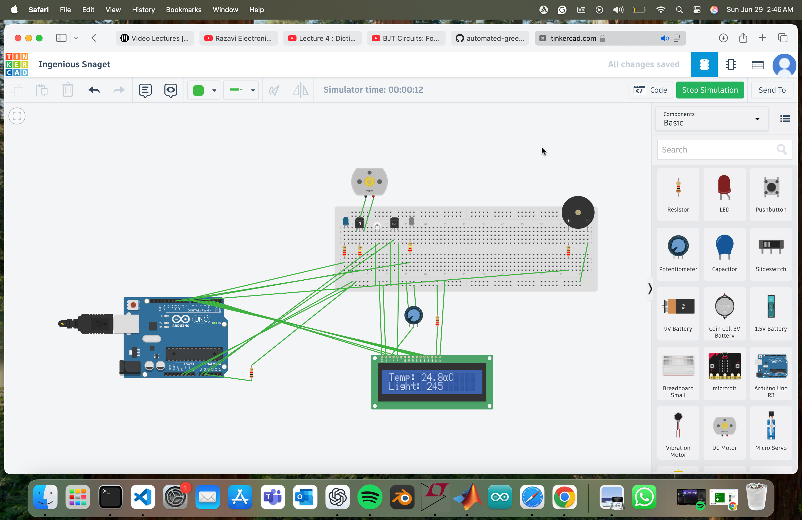

# Automated Greenhouse Controller (Arduino / Tinkercad)

A smart greenhouse simulation system built on Arduino, designed to monitor and regulate environmental conditions automatically.

##  Features
-  Temperature monitoring via analog sensor (TMP36)
-  Ambient light sensing and control
-  PWM-controlled fan for overheat regulation
-  Buzzer alert on high temperature
-  LCD display showing real-time data, rotating between sensors
-  Condition-based logic using `if` statements (no delay or millis)
-  Fully simulated on Tinkercad without hardware

##  Tech Used
- Arduino Uno
- TMP36 temperature sensor
- Photoresistor (light sensor)
- DC Motor (for fan)
- LEDs (grow light and fan indicators)
- Buzzer
- 16x2 I2C LCD display
- Tinkercad simulation

##  Screenshots

##  Author
Ajay Eemani — IIT Guwahati (ECE)
